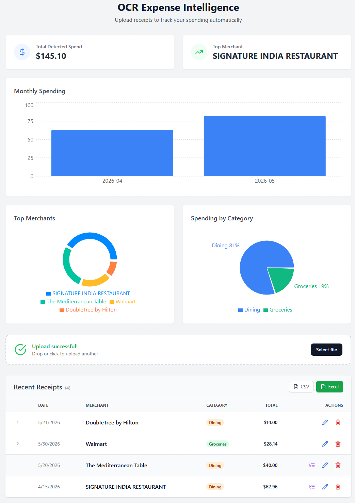
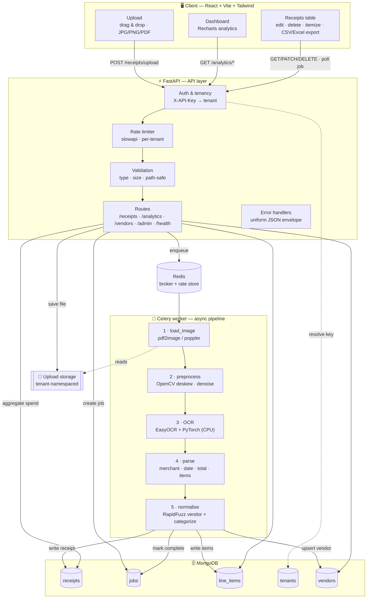
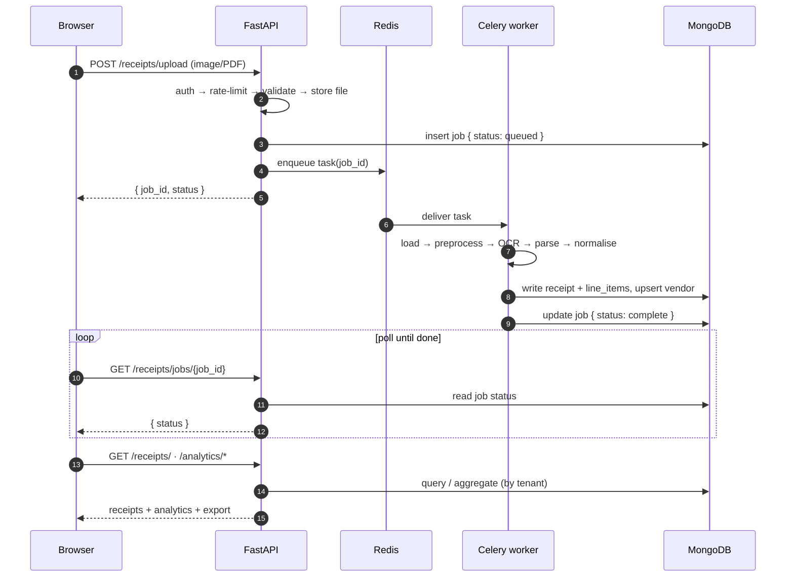

<div align="center">

# 🧾 OCR Expense Intelligence

### Snap a receipt → get structured expenses, itemized bills, and spending analytics.

A **FARM-stack** (FastAPI · React · MongoDB) app that uses AI-powered OCR to read
receipt photos, extract the merchant, date, total, and line items, categorize the
spend, and visualize it on a dashboard.

<br/>


<br/>

### 📊 [**View the live project summary →**](https://vgandhi1.github.io/OCR-Expense-Intelligence/presentation.html)

[](https://vgandhi1.github.io/OCR-Expense-Intelligence/presentation.html)

<br/>



<sub>The dashboard: detected-spend stats, monthly trend, merchant & category breakdowns, and a full-width receipts table with inline edit and CSV/Excel export.</sub>

</div>

> 💡 This is the working MVP of a larger B2B document-intelligence vision
> (codename **Extracta AI**). See [`docs/ARCHITECTURE.md`](docs/ARCHITECTURE.md) for the
> target vs. current architecture and [`docs/CODEBASE_IMPROVEMENTS.md`](docs/CODEBASE_IMPROVEMENTS.md)
> for the prioritized roadmap.

---

## 📑 Table of contents

- [Features](#-features)
- [Tech stack](#️-tech-stack)
- [Architecture](#-architecture)
- [Quick start](#-quick-start-docker)
- [API reference](#-api-reference)
- [Local development & testing](#-local-development--testing)
- [Configuration](#️-configuration)
- [Project structure](#-project-structure)
- [Documentation](#-documentation)
- [Roadmap](#️-roadmap)
- [License](#-license)

---

## ✨ Features

| | Feature | What it does |
|---|---------|--------------|
| 🔍 | **AI OCR extraction** | Pulls merchant, date, total, **currency, and a confidence score** from **JPG/PNG and PDF** receipts via [EasyOCR](https://github.com/JaidedAI/EasyOCR), aligning the "TOTAL" label with the price on the same line. |
| 🖼️ | **Image pre-processing** | Deskew, denoise, and contrast-normalize each page with OpenCV before OCR to lift accuracy on photos and scans. |
| 📄 | **PDF support** | Multi-page PDFs are rasterized (poppler/`pdf2image`); the first page is OCR'd and the page count is recorded. |
| 🧾 | **Itemized bills** | Extracts line items (product + price) into a dedicated `line_items` collection and shows them **most-expensive-first**. |
| 🏷️ | **Auto-categorization** | Sorts spend into Groceries, Dining, Transport, Shopping, Utilities, Entertainment, Health, or Uncategorized. |
| 🏬 | **Vendor normalization** | Fuzzy-matches messy merchant strings ("WALMART #4821", "Wal-Mart Supercenter") to one canonical vendor (RapidFuzz) so vendor analytics aren't fragmented; unknowns are queued for review. |
| ✏️ | **Edit & delete** | Fix any field (merchant, total, date, category) inline; deletes cascade to the receipt's line items. |
| 📊 | **Analytics dashboard** | Monthly-spend bar chart plus **Top Merchants** and **Spending by Category** pie charts, vendor and category-by-month aggregations, and an extraction-failure view (Recharts). |
| ⬇️ | **CSV / Excel export** | Export the receipts table to CSV or a real Excel (`.xls`) file — styled header, currency-formatted totals — straight from the browser. |
| 🔑 | **API-key auth** | `X-API-Key` resolves a tenant from the `tenants` collection (SHA-256 hashed keys); an admin endpoint issues keys. Falls back to `X-Tenant-ID` in dev. |
| 🚦 | **Rate limiting** | Per-tenant/key limits (slowapi) on upload and polling, backed by Redis so they hold across API replicas. |
| ❤️ | **Health probes** | `/health` (liveness) and `/health/ready` (MongoDB + Redis readiness) for container/LB checks. |
| ⚡ | **Async by design** | Upload returns a `job_id` instantly; a Celery worker runs OCR off the request path while the UI polls. |
| 🐳 | **Containerized** | One `docker compose up` brings up the entire stack. |

---

## 🛠️ Tech stack

| Layer | Technology |
|-------|-----------|
| **Backend API** | FastAPI · Uvicorn · Motor (async MongoDB) · slowapi (rate limiting) · RapidFuzz (vendor matching) |
| **Worker** | Celery + Redis broker · PyMongo · EasyOCR · PyTorch (CPU) · OpenCV · Pillow · pdf2image/poppler |
| **Database** | MongoDB (`receipts`, `jobs`, `line_items`, `tenants`, `vendors`) + Mongo-Express admin UI |
| **Frontend** | React · Vite · TailwindCSS · Recharts · Axios |
| **Infra** | Docker & Docker Compose |

---

## 🏗 Architecture

The API only **authenticates, validates, stores, and enqueues** — it never runs OCR.
A Celery worker does the heavy lifting off the request path; the UI polls a job until
it completes.

### End-to-end component flow



### Request lifecycle (async upload)



---

## 🚀 Quick start (Docker)

**Prerequisites:** Docker Desktop (or Docker Engine + Compose v2). On Windows, use WSL2.

```bash
docker compose up --build
```

Then open:

| Service | URL |
|---------|-----|
| 🖥️ Frontend dashboard | http://localhost:3000 |
| 📚 API docs (Swagger) | http://localhost:8000/docs |
| 🗄️ MongoDB admin (Mongo-Express) | http://localhost:8081 |

> ⚠️ **Port conflicts?** If `8000` or `3000` are taken, use the included override to
> remap to `18000` / `13000` / `18081` (it also sets `VITE_API_URL` and `ALLOWED_ORIGINS`):
>
> ```bash
> docker compose -f docker-compose.yml -f docker-compose.demo.yml up -d
> ```

**Try it:** drop a receipt image or PDF (or one from `test_fixtures/`) onto the dashboard.
Use the 🔽 list icon on a row to generate its itemized bill, ✏️ to edit, or 🗑️ to delete,
and the **CSV / Excel** buttons to export the table.

---

## 🔌 API reference

Base URL: `http://localhost:8000`. **Tenant resolution** per request: `X-API-Key`
(hashed, looked up in `tenants`) → `X-Tenant-ID` dev fallback (alphanumeric, `_`,
`-`, max 64 chars) → `default`. Set `REQUIRE_API_KEY=1` to make a valid key mandatory.

| Method | Path | Description |
|--------|------|-------------|
| `GET` | `/` | Root message |
| `GET` | `/health` | Liveness (always 200 if the process is up) |
| `GET` | `/health/ready` | Readiness — 200 if MongoDB + Redis reachable, else 503 |
| `POST` | `/receipts/upload` | Upload an **image or PDF** (`file` form field) → `{ job_id, status }` · rate-limited 20/min |
| `GET` | `/receipts/jobs/{job_id}` | Poll job status (`queued` → `processing` → `complete`/`failed`) · rate-limited 120/min |
| `GET` | `/receipts/` | List receipts for the tenant |
| `PATCH` | `/receipts/{id}` | Update `merchant_name`, `total_amount`, `date`, `category` |
| `DELETE` | `/receipts/{id}` | Delete a receipt + its line items (`204`) |
| `POST` | `/receipts/{id}/itemize` | Derive line items from the receipt's OCR text |
| `GET` | `/analytics/monthly` | Spend grouped by month |
| `GET` | `/analytics/merchant` | Top 5 merchants by spend |
| `GET` | `/analytics/category` | Total spend grouped by category (powers the category pie) |
| `GET` | `/analytics/vendors` | Spend grouped by canonical vendor (last N days) |
| `GET` | `/analytics/categories` | Category spend by month |
| `GET` | `/analytics/extraction-failures` | Receipts/items flagged `needs_review` |
| `GET` | `/vendors/` | List the tenant's vendors (`?needs_review=true` for the review queue) |
| `POST` | `/vendors/{id}/confirm` | Mark a vendor reviewed, optionally adding an alias |
| `POST` | `/admin/tenants` | Issue a tenant API key (requires `X-Admin-Key`; hidden from schema) |

Errors return `{ "detail": "...", "code": "..." }`; rate-limited requests get `429` with `code: RATE_LIMITED`, and unexpected failures return a generic `500` (`code: INTERNAL_ERROR`) without leaking internals.

<details>
<summary><b>📋 Example flow (click to expand)</b></summary>

```bash
# 1. Upload a receipt
curl -X POST http://localhost:8000/receipts/upload \
  -F "file=@test_fixtures/receipt_walmart.jpg" \
  -H "X-Tenant-ID: acme"
# → {"job_id":"...","status":"queued"}

# 2. Poll until complete
curl http://localhost:8000/receipts/jobs/JOB_ID -H "X-Tenant-ID: acme"
# → {"status":"complete","receipt_id":"..."}

# 3. Generate the itemized bill
curl -X POST http://localhost:8000/receipts/RECEIPT_ID/itemize -H "X-Tenant-ID: acme"
# → { ..., "items":[{"description":"Eggs","amount":3.49,"qty":1}, ...] }

# 4. Correct a field
curl -X PATCH http://localhost:8000/receipts/RECEIPT_ID \
  -H "Content-Type: application/json" \
  -d '{"merchant_name":"Walmart","total_amount":47.83}'

# 5. View analytics
curl http://localhost:8000/analytics/monthly  -H "X-Tenant-ID: acme"
curl http://localhost:8000/analytics/merchant -H "X-Tenant-ID: acme"
```

</details>

---

## 🧪 Local development & testing

Use the project virtualenv so the global interpreter (often PEP 668
"externally managed") doesn't get in the way.

```bash
python3 -m venv .venv          # if one doesn't exist
source .venv/bin/activate
pip install -r requirements.txt -r requirements-dev.txt
```

**Generate sample receipts** — deterministic, OCR-legible fixtures, no need to
source your own images:

```bash
python test_fixtures/generate_fixtures.py
# → test_fixtures/receipt_{walmart,starbucks,shell,blurry}.jpg
```

**Run the test suite** — no Docker, MongoDB, or Redis needed (`mongomock-motor`
provides an in-memory DB and the Celery enqueue is stubbed):

```bash
pytest                                                   # fast unit + API tests
RUN_OCR=1 pytest backend/tests/test_ocr_end_to_end.py    # real EasyOCR (downloads weights once)
```

> 🧠 The end-to-end OCR test writes model weights to `~/.EasyOCR`. If your home
> directory isn't writable:
> `EASYOCR_MODULE_PATH="$(pwd)/.easyocr_models" RUN_OCR=1 pytest ...`

Tests cover tenant/path validation, OCR parsing & categorization, line-item
extraction, the upload→job flow, edit/delete/itemize, tenant isolation, and
analytics aggregation.

**Frontend (outside Docker):**

```bash
cd frontend
npm install
npm run dev        # Vite dev server on :5173
```

---

## ⚙️ Configuration

All config is via environment variables (Docker Compose supplies sensible defaults,
so a `.env` is optional). See [`.env.example`](.env.example).

| Variable | Used by | Default | Purpose |
|----------|---------|---------|---------|
| `MONGODB_URL` | API, worker | `mongodb://mongo:27017` | MongoDB connection |
| `REDIS_URL` | API, worker | `redis://redis:6379/0` | Celery broker + result backend |
| `UPLOAD_ROOT` | API, worker | `/data/uploads` | Raw upload storage (tenant/job namespaced) |
| `ALLOWED_ORIGINS` | API | `http://localhost:3000,http://localhost:5173` | CORS allow-list (comma-separated) |
| `ADMIN_KEY` | API | `dev-admin-key` (compose) | Secret for `POST /admin/tenants`; endpoint returns `503` until set |
| `REQUIRE_API_KEY` | API | `0` | `1` makes a valid `X-API-Key` mandatory (disables `X-Tenant-ID`/`default` fallback) |
| `APP_RATELIMIT_ENABLED` | API | `1` | `0` disables rate limiting (used by tests) |
| `RATELIMIT_STORAGE_URI` | API | `memory://` | slowapi counter store; compose points it at Redis db 1 for multi-replica limits |
| `VITE_API_URL` | frontend | `http://localhost:8000` | API base URL baked into the UI |

---

## 📂 Project structure

```
.
├── backend/
│   ├── routes/             # API endpoints (receipts, analytics, admin, vendors)
│   ├── tests/              # pytest suite (mongomock-backed, no Docker needed)
│   ├── main.py             # FastAPI app + CORS + lifespan + health/error/rate-limit wiring
│   ├── auth.py             # API-key hashing + get_tenant_id dependency
│   ├── health.py           # MongoDB/Redis readiness probes
│   ├── errors.py           # Typed errors + safe catch-all handler ({detail, code})
│   ├── rate_limit.py       # slowapi limiter (per-tenant key, Redis-backed)
│   ├── database.py         # MongoDB connection + index setup
│   ├── celery_app.py       # Celery application
│   ├── tasks.py            # Background OCR job
│   ├── ocr_engine.py       # EasyOCR + field parsing & categorization
│   ├── receipt_parsing.py  # Lightweight line-item text parser (no ML deps)
│   ├── line_items_writer.py# Fan parsed items into the line_items collection
│   ├── vendor_normaliser.py# Fuzzy merchant→canonical vendor resolution
│   ├── pdf_converter.py    # Load images / rasterize PDFs (pdf2image)
│   ├── preprocess.py       # OpenCV deskew/denoise/contrast for OCR quality
│   ├── storage_paths.py    # Tenant-prefixed, traversal-safe upload paths
│   └── models.py           # Pydantic models
├── frontend/
│   └── src/
│       ├── components/     # Upload, ReceiptsList (edit/delete/itemize/export), Dashboard
│       ├── utils/exporters.js # CSV + Excel (SpreadsheetML) export helpers
│       └── api/client.js   # Axios client (reads VITE_API_URL)
├── test_fixtures/
│   └── generate_fixtures.py
├── docs/
│   ├── ARCHITECTURE.md         # Target vs. current architecture
│   ├── CODEBASE_IMPROVEMENTS.md # Prioritized improvement playbook
│   └── PRODUCTION_DEPLOY.md    # Full production deployment guide
├── docker-compose.yml
├── docker-compose.demo.yml # Host-port remap override (avoids 8000/3000 conflicts)
├── requirements.txt        # Runtime deps
├── requirements-dev.txt    # Test/dev deps
└── pytest.ini
```

---

## 📚 Documentation

| Doc | What's inside |
|-----|---------------|
| 🧭 [`docs/ARCHITECTURE.md`](docs/ARCHITECTURE.md) | Target vs. current architecture, data model, and request flow |
| 🛠️ [`docs/CODEBASE_IMPROVEMENTS.md`](docs/CODEBASE_IMPROVEMENTS.md) | The prioritized improvement playbook (Priorities 1–10) with code |
| 📗 [`docs/PRODUCTION_DEPLOY.md`](docs/PRODUCTION_DEPLOY.md) | End-to-end production deploy (hosting, CI/CD, domain, SSL, monitoring, cost) |

---

## 🗺️ Roadmap

**Shipped:** async OCR with confidence/currency, image pre-processing (OpenCV),
PDF support, itemized extraction into a `line_items` collection, categorization,
receipt management, expanded analytics, API-key authentication, vendor normalization,
rate limiting, health/readiness endpoints, and consistent error handling.

**Pending** (tracked in [`docs/CODEBASE_IMPROVEMENTS.md`](docs/CODEBASE_IMPROVEMENTS.md)):
`/v1/` API versioning (Priority 6) and S3/MinIO object storage (Priority 7). Larger
product bets (GPU VLM inference, custom schemas, webhooks) live in
[`docs/ARCHITECTURE.md`](docs/ARCHITECTURE.md).

---

## 📄 License

Released under the **MIT License**.

<div align="center">
<sub>Built with FastAPI, React, MongoDB, and EasyOCR.</sub>
</div>
